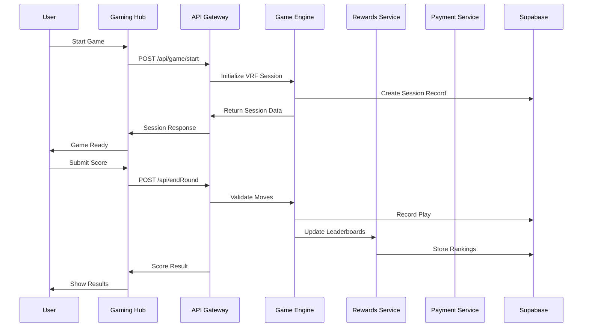
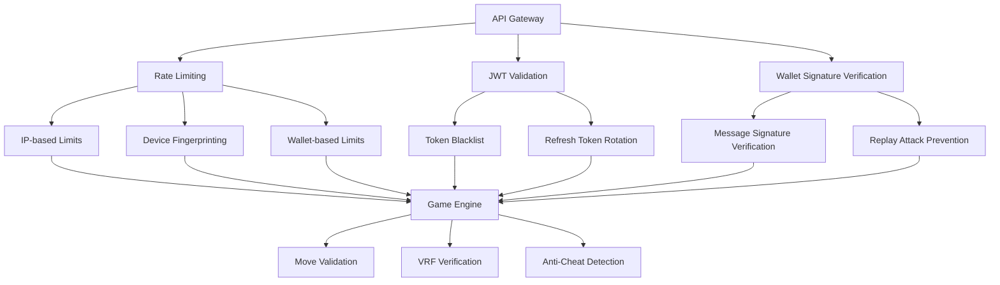

# 🎮 GameFi Platform - Comprehensive API Documentation

> **Complete API reference, SDK integration guide, and developer documentation for the GameFi Play-to-Earn platform**

## 📋 Table of Contents

- [🚀 Quick Start](#-quick-start)
- [🔑 Authentication](#-authentication)
- [🎮 Game APIs](#-game-apis)
- [🏆 Leaderboard APIs](#-leaderboard-apis)
- [💰 Payment APIs](#-payment-apis)
- [🎲 VRF & Randomness APIs](#-vrf--randomness-apis)
- [🎟️ Raffle System APIs](#️-raffle-system-apis)
- [🔒 Security APIs](#-security-apis)
- [📊 Analytics APIs](#-analytics-apis)
- [🤖 Social Media APIs](#-social-media-apis)
- [🛠️ SDK Reference](#️-sdk-reference)
- [📱 Component Library](#-component-library)
- [🏗️ Architecture](#️-architecture)

---

## 🚀 Quick Start

### Base URLs
- **Production**: `https://api-gateway-production.up.railway.app`
- **Development**: `http://localhost:3000`

### Authentication
All API requests require either:
- **Bearer Token**: `Authorization: Bearer <jwt_token>`
- **Wallet Signature**: `X-Wallet-Signature: <signed_message>`

### Response Format
```json
{
  "success": true,
  "data": {},
  "error": null,
  "timestamp": "2024-01-01T00:00:00Z",
  "requestId": "req_123456789"
}
```

---

## 🔑 Authentication

### Wallet Connection
Connect a Solana wallet and verify ownership.

**POST** `/api/wallet/connect`

```typescript
interface WalletConnectRequest {
  walletAddress: string;
  signature: string;
  message: string;
}

interface WalletConnectResponse {
  accessToken: string;
  refreshToken: string;
  user: {
    walletAddress: string;
    totalLives: number;
    highScore: number;
    joinedAt: string;
  };
}
```

**Example Request:**
```javascript
const response = await fetch('/api/wallet/connect', {
  method: 'POST',
  headers: {
    'Content-Type': 'application/json'
  },
  body: JSON.stringify({
    walletAddress: '9WzDXwBbmkg8ZTbNMqUxvQRAyrZzDsGYdLVL9zYtAWWM',
    signature: 'base64_signature',
    message: 'Connect to GameFi Platform'
  })
});

const { data } = await response.json();
console.log('Connected:', data.user.walletAddress);
```

### JWT Token Refresh
**POST** `/api/auth/refresh`

```typescript
interface RefreshRequest {
  refreshToken: string;
}

interface RefreshResponse {
  accessToken: string;
  expiresIn: number;
}
```

---

## 🎮 Game APIs

### Start Game Session
Initialize a new game session with VRF seed generation.

**POST** `/api/game/start`

```typescript
interface GameStartRequest {
  walletAddress: string;
  gameId?: string; // Default: 'tetris'
  gameType?: 'tetris' | 'memory' | 'puzzle';
}

interface GameStartResponse {
  sessionId: string;
  seed: string;
  seedHash: string;
  vrfSignature: string;
  playerLives: number;
}
```

**Example:**
```javascript
const session = await fetch('/api/game/start', {
  method: 'POST',
  headers: {
    'Authorization': `Bearer ${token}`,
    'Content-Type': 'application/json'
  },
  body: JSON.stringify({
    walletAddress: userWallet,
    gameType: 'tetris'
  })
});

const { sessionId, seed } = await session.json();
```

### End Game Round
Submit game moves and validate score.

**POST** `/api/endRound`

```typescript
interface GameMove {
  type: 'move' | 'rotate' | 'drop' | 'hold';
  timestamp: number;
  direction?: 'left' | 'right' | 'down';
  rotation?: 'cw' | 'ccw';
  data?: any; // Game-specific data
}

interface EndRoundRequest {
  wallet: string;
  moves: GameMove[];
  seed: string;
  gameId?: string;
  vrfSessionId?: string;
  vrfPieces?: PieceGenerationResult[];
}

interface EndRoundResponse {
  status: 'success' | 'failed';
  score: number;
  playId: string;
  seedHash: string;
  gameData: any;
  remainingLives: number;
  vrfValidated: boolean;
}
```

**Example:**
```javascript
const result = await fetch('/api/endRound', {
  method: 'POST',
  headers: {
    'Authorization': `Bearer ${token}`,
    'Content-Type': 'application/json'
  },
  body: JSON.stringify({
    wallet: userWallet,
    moves: gameMovesArray,
    seed: sessionSeed,
    gameId: 'tetris',
    vrfSessionId: vrfSession.sessionId,
    vrfPieces: generatedPieces
  })
});

const { score, remainingLives } = await result.json();
```

### Get User Stats
**GET** `/api/user/stats?wallet={address}`

```typescript
interface UserStats {
  walletAddress: string;
  totalGamesPlayed: number;
  highScore: number;
  totalScore: number;
  averageScore: number;
  currentStreak: number;
  longestStreak: number;
  totalLives: number;
  achievements: Achievement[];
  lastPlayed: string;
}
```

---

## 🏆 Leaderboard APIs

### Get Leaderboard
**GET** `/api/leaderboard`

**Query Parameters:**
- `period`: `daily` | `weekly` | `monthly` | `all-time`
- `gameId`: Game identifier (default: 'tetris')
- `limit`: Number of entries (default: 50, max: 100)
- `offset`: Pagination offset

```typescript
interface LeaderboardEntry {
  rank: number;
  walletAddress: string;
  displayName?: string;
  score: number;
  gameData: any;
  timestamp: string;
  verified: boolean;
}

interface LeaderboardResponse {
  entries: LeaderboardEntry[];
  totalEntries: number;
  period: string;
  lastUpdated: string;
  userRank?: number;
  userScore?: number;
}
```

**Example:**
```javascript
const leaderboard = await fetch('/api/leaderboard?period=daily&limit=10', {
  headers: { 'Authorization': `Bearer ${token}` }
});

const { entries, userRank } = await leaderboard.json();
entries.forEach((entry, i) => {
  console.log(`${entry.rank}. ${entry.walletAddress}: ${entry.score}`);
});
```

### Get User Rank
**GET** `/api/leaderboard/rank?wallet={address}&period={period}`

```typescript
interface UserRankResponse {
  rank: number | null;
  score: number;
  period: string;
  totalPlayers: number;
  percentile: number;
}
```

---

## 💰 Payment APIs

### Get Life Prices
**GET** `/api/payments/prices`

```typescript
interface LifePrices {
  mworPriceUsd: number;
  packages: {
    cheap: { lives: number; priceMwor: number; priceUsd: number };
    mid: { lives: number; priceMwor: number; priceUsd: number };
    high: { lives: number; priceMwor: number; priceUsd: number };
  };
  timestamp: number;
}
```

### Buy Lives
**POST** `/api/buyLife`

```typescript
interface BuyLifeRequest {
  wallet: string;
  package: 'cheap' | 'mid' | 'high';
  paymentMethod: 'mwor' | 'sol';
}

interface BuyLifeResponse {
  paymentAddress: string;
  amount: number;
  currency: 'MWOR' | 'SOL';
  expiresAt: string;
  livesToReceive: number;
  transactionId: string;
}
```

**Example:**
```javascript
const purchase = await fetch('/api/buyLife', {
  method: 'POST',
  headers: {
    'Authorization': `Bearer ${token}`,
    'Content-Type': 'application/json'
  },
  body: JSON.stringify({
    wallet: userWallet,
    package: 'mid',
    paymentMethod: 'mwor'
  })
});

const { paymentAddress, amount } = await purchase.json();
// Show payment modal to user
```

### Claim Daily Lives
**POST** `/api/claimDaily`

```typescript
interface ClaimDailyRequest {
  wallet: string;
  gameId?: string;
}

interface ClaimDailyResponse {
  success: boolean;
  livesAdded: number;
  totalLives: number;
  nextClaimTime: string;
  bonusLives?: number;
}
```

---

## 🎲 VRF & Randomness APIs

### Initialize VRF Session
**POST** `/api/vrf/session`

```typescript
interface VRFSessionRequest {
  walletAddress: string;
  gameType: string;
}

interface VRFSession {
  sessionId: string;
  walletAddress: string;
  masterSeed: string;
  pieceIndex: number;
  startTime: number;
  vrfSignature: string;
}
```

### Generate VRF Piece
**POST** `/api/vrf/generate-piece`

```typescript
interface PieceGenerationResult {
  pieceType: number; // 0-6 for tetromino types
  sessionId: string;
  pieceIndex: number;
  seedUsed: string;
  proof: string;
}
```

### Verify VRF Proof
**POST** `/api/vrf/verify`

```typescript
interface VRFVerifyRequest {
  sessionId: string;
  pieces: PieceGenerationResult[];
}

interface VRFVerifyResponse {
  valid: boolean;
  verifiedPieces: number;
  errors: string[];
}
```

---

## 🎟️ Raffle System APIs

### Get Daily Raffle Status
**GET** `/api/raffles/daily/status`

```typescript
interface DailyRaffleStatus {
  date: string;
  isActive: boolean;
  drawTime: string;
  qualifiedPlayers: number;
  totalTickets: number;
  winners?: string[];
  userQualified: boolean;
  userTickets: number;
  userRank?: number;
}
```

### Get Raffle Qualification
**GET** `/api/raffles/qualification?wallet={address}&date={date}`

```typescript
interface RaffleQualification {
  qualified: boolean;
  rank?: number;
  score?: number;
  tickets?: number;
  tier?: 'rank1' | 'ranks2to5' | 'ranks6to10' | 'remaining';
  merkleProof?: string[];
}
```

### Execute Raffle Draw (Admin)
**POST** `/api/raffles/draw`

```typescript
interface RaffleDrawRequest {
  date: string;
  numberOfWinners: number;
  force?: boolean; // Override time restrictions
}

interface RaffleDrawResponse {
  winners: string[];
  vrfSeed: string;
  vrfSignature: string;
  totalTickets: number;
  drawTimestamp: number;
  merkleRoot: string;
  verified: boolean;
}
```

---

## 🔒 Security APIs

### Generate Game Seed
**POST** `/api/security/commit-seed`

```typescript
interface SeedCommitRequest {
  walletAddress: string;
  sessionId: string;
}

interface SeedCommitResponse {
  seedHash: string;
  sessionId: string;
  expiresAt: string;
}
```

### Reveal Game Seed
**POST** `/api/security/reveal-seed`

```typescript
interface SeedRevealRequest {
  sessionId: string;
}

interface SeedRevealResponse {
  seed: string;
  revealed: boolean;
  verificationHash: string;
}
```

### Detect Suspicious Activity
**POST** `/api/security/analyze-moves`

```typescript
interface MoveAnalysisRequest {
  moves: GameMove[];
  sessionId: string;
}

interface MoveAnalysisResponse {
  suspicious: boolean;
  confidence: number;
  flags: string[];
  recommendation: 'allow' | 'review' | 'reject';
}
```

---

## 📊 Analytics APIs

### Get Platform Stats
**GET** `/api/analytics/platform-stats`

```typescript
interface PlatformStats {
  totalUsers: number;
  activeUsers24h: number;
  totalGamesPlayed: number;
  totalRevenue: number;
  averageScore: number;
  topScoreToday: number;
  gamesPlayedToday: number;
  newUsersToday: number;
}
```

### Get Game Analytics
**GET** `/api/analytics/game-stats?gameId={id}&period={period}`

```typescript
interface GameAnalytics {
  gameId: string;
  period: string;
  totalPlayers: number;
  totalGames: number;
  averageScore: number;
  highestScore: number;
  averageSessionLength: number;
  retentionRate: number;
  conversionRate: number;
}
```

### Track Custom Event
**POST** `/api/analytics/track`

```typescript
interface TrackEventRequest {
  event: string;
  properties: Record<string, any>;
  userId?: string;
  sessionId?: string;
}
```

---

## 🤖 Social Media APIs

### Send Telegram Announcement
**POST** `/api/social/telegram/announce`

```typescript
interface TelegramAnnounceRequest {
  message: string;
  parseMode?: 'HTML' | 'Markdown';
  channels?: string[];
}
```

### Post to Twitter
**POST** `/api/social/twitter/post`

```typescript
interface TwitterPostRequest {
  text: string;
  media?: string[];
  replyTo?: string;
}
```

### Get Social Stats
**GET** `/api/social/stats`

```typescript
interface SocialStats {
  telegram: {
    subscribers: number;
    messagesPosted: number;
    engagement: number;
  };
  twitter: {
    followers: number;
    tweets: number;
    impressions: number;
  };
}
```

---

## 🛠️ SDK Reference

### GameFi SDK Integration

**Installation:**
```bash
npm install @gamefi/sdk
# or
<script src="https://cdn.gamefi.com/sdk.js"></script>
```

**Basic Setup:**
```typescript
import { GameFiSDK } from '@gamefi/sdk';

const gamefi = new GameFiSDK({
  gameId: 'your-game-id',
  gameName: 'Your Game Name',
  apiEndpoint: 'https://api-gateway-production.up.railway.app',
  
  // Optional configuration
  livesConfig: {
    maxLives: 5,
    enableLivesSystem: true,
    showLivesUI: true
  },
  
  leaderboardConfig: {
    enableLeaderboards: true,
    showLeaderboardUI: true,
    autoSubmitScores: true
  },
  
  uiConfig: {
    theme: 'dark',
    position: 'top-right',
    showBuyLivesButton: true
  },
  
  // Event callbacks
  onGameStart: () => console.log('Game started'),
  onGameEnd: (score) => console.log('Score:', score),
  onWalletConnected: (wallet) => console.log('Wallet:', wallet),
  onError: (error) => console.error('Error:', error)
});

// Initialize the SDK
await gamefi.initialize();
```

### SDK Methods

#### Core Methods
```typescript
// Connect wallet
const walletAddress = await gamefi.connectWallet();

// Start game session
const session = await gamefi.startGameSession();

// Track game moves (for anti-cheat)
gamefi.trackMove({
  type: 'move',
  timestamp: Date.now(),
  direction: 'left'
});

// End game and submit score
await gamefi.endGameSession(finalScore, gameData);

// Get user data
const userData = gamefi.getUserData();

// Buy lives
await gamefi.buyLives();

// Claim daily lives
await gamefi.claimDailyLives();

// Get leaderboard
const leaderboard = await gamefi.getLeaderboard('daily');
```

#### VRF Integration
```typescript
// Initialize VRF session for secure randomness
const vrfSession = await gamefi.initializeVRFSession();

// Generate cryptographically random game pieces
const piece = await gamefi.generateVRFPiece(vrfSession.sessionId);

// Verify VRF proofs
const isValid = await gamefi.verifyVRFProof(piece);
```

### SDK Events
```typescript
// Listen to SDK events
gamefi.on('livesChanged', (lives) => {
  console.log('Lives remaining:', lives);
});

gamefi.on('scoreSubmitted', (result) => {
  console.log('Score submitted:', result.score);
});

gamefi.on('leaderboardUpdated', (position) => {
  console.log('New rank:', position);
});

gamefi.on('walletDisconnected', () => {
  console.log('Wallet disconnected');
});
```

---

## 📱 Component Library

### React Components

#### WalletConnectButton
```tsx
import { WalletConnectButton } from '@gamefi/components';

<WalletConnectButton
  onConnect={(wallet) => console.log('Connected:', wallet)}
  onDisconnect={() => console.log('Disconnected')}
  className="custom-button-class"
/>
```

#### LivesDisplay
```tsx
import { LivesDisplay } from '@gamefi/components';

<LivesDisplay
  lives={userLives}
  maxLives={5}
  onBuyLives={() => openPurchaseModal()}
  showBuyButton={true}
/>
```

#### Leaderboard
```tsx
import { Leaderboard } from '@gamefi/components';

<Leaderboard
  gameId="tetris"
  period="daily"
  limit={10}
  showUserRank={true}
  onUserClick={(user) => showProfile(user)}
/>
```

#### ScoreSubmission
```tsx
import { ScoreSubmission } from '@gamefi/components';

<ScoreSubmission
  score={finalScore}
  gameData={gameSessionData}
  onSubmit={(result) => handleScoreSubmit(result)}
  onError={(error) => showError(error)}
/>
```

### Vue.js Components

```vue
<template>
  <GameFiProvider :config="gamefiConfig">
    <WalletConnection @connected="onWalletConnect" />
    <LivesManager @lives-changed="onLivesChange" />
    <LeaderboardWidget game-id="tetris" period="daily" />
  </GameFiProvider>
</template>

<script>
import { GameFiProvider, WalletConnection, LivesManager, LeaderboardWidget } from '@gamefi/vue';

export default {
  components: {
    GameFiProvider,
    WalletConnection,
    LivesManager,
    LeaderboardWidget
  },
  data() {
    return {
      gamefiConfig: {
        apiEndpoint: 'https://api-gateway-production.up.railway.app',
        gameId: 'your-game'
      }
    };
  }
};
</script>
```

---

## 🏗️ Architecture

### Microservices Overview

| Service | Port | Purpose | Dependencies |
|---------|------|---------|--------------|
| **API Gateway** | 3000 | Request routing, authentication | All services |
| **Gaming Hub** | 3001 | Frontend application | API Gateway |
| **User Service** | 3010 | User management, profiles | Supabase |
| **Game Engine** | 3011 | Game logic, VRF, anti-cheat | Supabase, Switchboard |
| **Rewards Service** | 3012 | Leaderboards, raffles | Supabase, VRF |
| **Payment Service** | 3013 | Payment processing | Solana, Helius |
| **Analytics Service** | 3014 | Data collection, metrics | ClickHouse, Redis |
| **Telegram Bot** | 3015 | Social automation | Telegram API |
| **Twitter Bot** | 3016 | Social announcements | Twitter API |
| **Social Hub** | 3017 | Social coordination | Telegram, Twitter |
| **Scheduler** | 3018 | Background tasks | Bull Queue |
| **Admin Dashboard** | 3019 | Management interface | All services |

### Data Flow



### Security Architecture



---

## 📋 Error Codes

### Standard HTTP Codes
- `200` - Success
- `400` - Bad Request
- `401` - Unauthorized
- `403` - Forbidden
- `404` - Not Found
- `429` - Rate Limited
- `500` - Internal Server Error

### Custom Error Codes
- `WALLET_NOT_CONNECTED` - User wallet not connected
- `INSUFFICIENT_LIVES` - No lives remaining
- `INVALID_GAME_SESSION` - Session expired or invalid
- `SCORE_VALIDATION_FAILED` - Move sequence validation failed
- `VRF_VERIFICATION_FAILED` - VRF proof verification failed
- `PAYMENT_PROCESSING_ERROR` - Payment transaction failed
- `RAFFLE_NOT_ACTIVE` - Raffle period not active
- `USER_NOT_QUALIFIED` - User doesn't meet raffle criteria

---

## 🔍 Testing

### API Testing Examples

```bash
# Health check
curl https://api-gateway-production.up.railway.app/health

# Get leaderboard
curl -H "Authorization: Bearer $TOKEN" \
  "https://api-gateway-production.up.railway.app/api/leaderboard?period=daily&limit=5"

# Start game session
curl -X POST \
  -H "Authorization: Bearer $TOKEN" \
  -H "Content-Type: application/json" \
  -d '{"walletAddress":"9WzDXwBbmkg8ZTbNMqUxvQRAyrZzDsGYdLVL9zYtAWWM"}' \
  "https://api-gateway-production.up.railway.app/api/game/start"
```

### SDK Testing
```javascript
// Test SDK integration
const gamefi = new GameFiSDK({
  gameId: 'test-game',
  apiEndpoint: 'http://localhost:3000'
});

await gamefi.initialize();
console.log('SDK initialized:', gamefi.isReady());

// Test wallet connection
try {
  const wallet = await gamefi.connectWallet();
  console.log('Wallet connected:', wallet);
} catch (error) {
  console.error('Connection failed:', error);
}
```

---

## 📞 Support

- **Documentation**: [GitHub Wiki](https://github.com/your-username/gamefi-platform/wiki)
- **Issues**: [GitHub Issues](https://github.com/your-username/gamefi-platform/issues)
- **Community**: [Telegram](https://t.me/mwor_feed/2)
- **Email**: support@gamefi.com

---

*Last updated: 2024-01-01*
*API Version: 1.0.0*