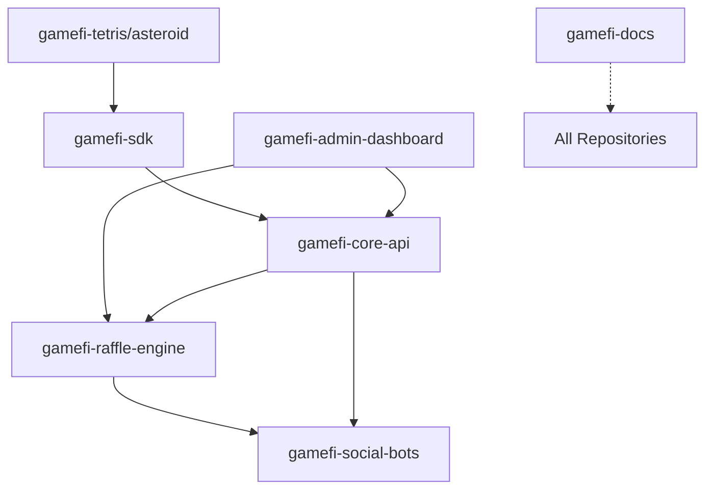

# Complete GameFi Platform Repository Structure

## 🏗️ Total: 8 Independent Repositories

### 1. **gamefi-core-api**
- **Purpose**: Core P2E mechanics and platform foundation
- **Features**: Lives management, game sessions, payment processing, authentication
- **Tech Stack**: Next.js/Express, TypeScript, Supabase
- **Deployment**: Vercel/Railway

### 2. **gamefi-raffle-engine**
- **Purpose**: Completely independent raffle and lottery system
- **Features**: Ticket distribution, winner selection, VRF integration, prize management
- **Tech Stack**: Node.js/Deno, Supabase Edge Functions
- **Deployment**: Cloudflare Workers/Deno Deploy

### 3. **gamefi-social-bots**
- **Purpose**: All social media integrations and automated announcements
- **Features**: Telegram bot, Twitter bot, Discord bot, cross-platform coordination
- **Tech Stack**: Node.js, Bot SDKs, Message Queue
- **Deployment**: Heroku/DigitalOcean

### 4. **gamefi-tetris**
- **Purpose**: Tetris game implementation
- **Features**: Game engine, UI, GameFi SDK integration
- **Tech Stack**: React/Next.js, TypeScript, Canvas API
- **Deployment**: Vercel/Netlify

### 5. **gamefi-asteroid-blaster**
- **Purpose**: Asteroid Blaster game implementation
- **Features**: Game engine, UI, GameFi SDK integration
- **Tech Stack**: Phaser.js/React, TypeScript
- **Deployment**: Vercel/Netlify

### 6. **gamefi-sdk** *(The one you asked about!)*
- **Purpose**: JavaScript/TypeScript SDK for easy game integration
- **Features**: Wallet connection, session management, score submission, UI components
- **Tech Stack**: TypeScript, Rollup, React (optional)
- **Distribution**: NPM Registry, CDN, GitHub Releases

### 7. **gamefi-admin-dashboard**
- **Purpose**: Administrative interface for platform management
- **Features**: Analytics, user management, game configuration, revenue tracking
- **Tech Stack**: Next.js, React Admin, Recharts
- **Deployment**: Vercel with authentication

### 8. **gamefi-docs** *(Optional but recommended)*
- **Purpose**: Central documentation hub for all repositories
- **Features**: Architecture guides, API docs, integration tutorials
- **Tech Stack**: Docusaurus/VitePress
- **Deployment**: GitHub Pages/Netlify

## 🔗 Repository Relationships

## 📦 NPM Package Ecosystem

### Published Packages:
1. **@gamefi/sdk** - Main SDK for game developers
2. **@gamefi/types** - Shared TypeScript types (optional)
3. **@gamefi/utils** - Common utilities (optional)

### Internal Packages:
- Used between services but not published publicly
- Managed via GitHub packages or private registry

## 🚀 Benefits of This Structure

1. **Complete Independence**: Each repository can be developed, tested, and deployed independently
2. **Technology Freedom**: Each team can choose the best tools for their specific needs
3. **Scalability**: Scale only what needs scaling
4. **Clear Ownership**: Each repository has clear boundaries and responsibilities
5. **Easy Onboarding**: New developers can focus on just the repository they need
6. **Version Management**: Each component can evolve at its own pace
7. **Cost Optimization**: Different hosting solutions for different needs
8. **Security Isolation**: Compromised service doesn't affect others

## 🔧 Development Workflow

### For Game Developers:
1. Install SDK: `npm install @gamefi/sdk`
2. Integrate into their game
3. Never need to touch other repositories

### For Platform Developers:
1. Clone specific repository they're working on
2. Run locally with mock services
3. Deploy independently

### For Full Platform Development:
1. Use docker-compose to run all services
2. Or run specific services as needed
3. Each service has its own development environment

This structure provides maximum flexibility while maintaining clean boundaries between different aspects of the platform!