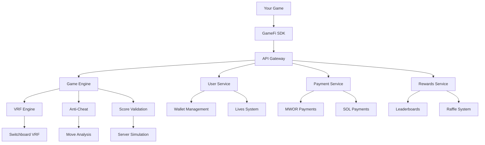

# 🛠️ GameFi Platform Developer Guide

> **Complete integration guide for transforming any game into a Web3 GameFi experience**

## 📋 Table of Contents

- [🚀 Getting Started](#-getting-started)
- [🎮 SDK Integration](#-sdk-integration)
- [🔧 Configuration](#-configuration)
- [🏗️ Architecture Overview](#️-architecture-overview)
- [🔌 API Integration](#-api-integration)
- [🎯 Game Types Support](#-game-types-support)
- [🔒 Security Best Practices](#-security-best-practices)
- [📊 Analytics & Monitoring](#-analytics--monitoring)
- [🚀 Deployment Guide](#-deployment-guide)
- [🐛 Troubleshooting](#-troubleshooting)

---

## 🚀 Getting Started

### Prerequisites

- **Node.js 18+**
- **Modern browser** with Web3 wallet support
- **Solana wallet** (Phantom, Solflare, etc.)
- **Basic knowledge** of JavaScript/TypeScript

### Quick Setup

1. **Install the SDK**
```bash
npm install @gamefi/sdk
# or via CDN
<script src="https://cdn.gamefi.com/sdk.js"></script>
```

2. **Basic Integration**
```javascript
import { GameFiSDK } from '@gamefi/sdk';

const gamefi = new GameFiSDK({
  gameId: 'your-unique-game-id',
  gameName: 'Your Awesome Game',
  apiEndpoint: 'https://api-gateway-production.up.railway.app'
});

await gamefi.initialize();
```

3. **Connect Wallet**
```javascript
const walletAddress = await gamefi.connectWallet();
console.log('Connected wallet:', walletAddress);
```

4. **Start Playing**
```javascript
// Start a game session
const session = await gamefi.startGameSession();

// ... your game logic here ...

// Submit score when game ends
await gamefi.endGameSession(finalScore, gameData);
```

---

## 🎮 SDK Integration

### Complete Integration Example

```html
<!DOCTYPE html>
<html>
<head>
    <title>My GameFi Game</title>
    <script src="https://cdn.gamefi.com/sdk.js"></script>
</head>
<body>
    <div id="game-container">
        <canvas id="game-canvas" width="800" height="600"></canvas>
        <div id="gamefi-ui"></div>
    </div>

    <script>
        // Initialize GameFi SDK
        const gamefi = new GameFiSDK({
            gameId: 'my-awesome-game',
            gameName: 'My Awesome Game',
            apiEndpoint: 'https://api-gateway-production.up.railway.app',
            
            // UI Configuration
            uiConfig: {
                theme: 'dark',
                position: 'top-right',
                showBuyLivesButton: true,
                showLeaderboardButton: true
            },
            
            // Lives System
            livesConfig: {
                maxLives: 5,
                enableLivesSystem: true,
                showLivesUI: true
            },
            
            // Leaderboards
            leaderboardConfig: {
                enableLeaderboards: true,
                showLeaderboardUI: true,
                autoSubmitScores: true
            },
            
            // Anti-cheat
            antiCheatConfig: {
                enableValidation: true,
                requireServerValidation: true,
                enableMoveTracking: true
            },
            
            // Event Callbacks
            onGameStart: () => {
                console.log('🎮 Game session started');
                startGameplay();
            },
            
            onGameEnd: (score, gameData) => {
                console.log('🏁 Game ended with score:', score);
                showGameOverScreen(score);
            },
            
            onLivesChanged: (lives) => {
                console.log('❤️ Lives remaining:', lives);
                updateLivesDisplay(lives);
            },
            
            onWalletConnected: (wallet) => {
                console.log('🔗 Wallet connected:', wallet);
                enableGameplay();
            },
            
            onError: (error) => {
                console.error('❌ GameFi error:', error);
                showErrorMessage(error);
            }
        });

        // Game variables
        let gameActive = false;
        let currentScore = 0;
        let gameSession = null;
        let moves = [];

        async function initializeGame() {
            try {
                // Initialize SDK
                await gamefi.initialize();
                console.log('✅ GameFi SDK initialized');
                
                // Show connect wallet button
                showConnectButton();
                
            } catch (error) {
                console.error('Failed to initialize GameFi:', error);
            }
        }

        async function startGameplay() {
            try {
                // Start game session with VRF
                gameSession = await gamefi.startGameSession();
                console.log('🎲 VRF seed:', gameSession.seed);
                
                // Initialize game state
                gameActive = true;
                currentScore = 0;
                moves = [];
                
                // Start your game loop
                gameLoop();
                
            } catch (error) {
                console.error('Failed to start game session:', error);
                showError('Failed to start game. Please try again.');
            }
        }

        function gameLoop() {
            if (!gameActive) return;
            
            // Your game logic here
            updateGame();
            renderGame();
            
            // Continue loop
            requestAnimationFrame(gameLoop);
        }

        function makeMove(moveType, data = {}) {
            if (!gameActive) return;
            
            // Track move for anti-cheat
            const move = {
                type: moveType,
                timestamp: Date.now(),
                ...data
            };
            
            moves.push(move);
            gamefi.trackMove(move);
            
            // Apply move to game state
            applyGameMove(move);
        }

        async function endGame() {
            if (!gameActive) return;
            
            gameActive = false;
            
            try {
                // Submit score with move validation
                const result = await gamefi.endGameSession(currentScore, {
                    moves: moves,
                    duration: Date.now() - gameSession.startTime,
                    seed: gameSession.seed
                });
                
                console.log('📊 Score submitted:', result);
                showGameResults(result);
                
            } catch (error) {
                console.error('Failed to submit score:', error);
                showError('Failed to submit score. Please try again.');
            }
        }

        // Your game-specific functions
        function updateGame() {
            // Game update logic
            // Update score, check collisions, etc.
        }

        function renderGame() {
            // Game rendering logic
            // Draw to canvas, update DOM, etc.
        }

        function applyGameMove(move) {
            // Apply the move to your game state
            switch(move.type) {
                case 'move':
                    // Handle movement
                    break;
                case 'action':
                    // Handle action
                    break;
                // ... other move types
            }
        }

        // UI Functions
        function showConnectButton() {
            // Show wallet connection UI
        }

        function enableGameplay() {
            // Enable game controls after wallet connection
        }

        function updateLivesDisplay(lives) {
            // Update lives counter in UI
        }

        function showGameResults(result) {
            // Show game over screen with results
        }

        function showError(message) {
            // Display error message to user
        }

        // Initialize when page loads
        window.addEventListener('load', initializeGame);
    </script>
</body>
</html>
```

### React Integration

```tsx
import React, { useEffect, useState } from 'react';
import { GameFiSDK } from '@gamefi/sdk';

const MyGame: React.FC = () => {
    const [gamefi, setGamefi] = useState<GameFiSDK | null>(null);
    const [walletConnected, setWalletConnected] = useState(false);
    const [lives, setLives] = useState(0);
    const [gameActive, setGameActive] = useState(false);
    const [score, setScore] = useState(0);

    useEffect(() => {
        initializeGameFi();
    }, []);

    const initializeGameFi = async () => {
        const sdk = new GameFiSDK({
            gameId: 'react-game',
            gameName: 'React Game',
            apiEndpoint: 'https://api-gateway-production.up.railway.app',
            
            onWalletConnected: (wallet) => {
                setWalletConnected(true);
                console.log('Wallet connected:', wallet);
            },
            
            onLivesChanged: (lives) => {
                setLives(lives);
            },
            
            onGameStart: () => {
                setGameActive(true);
                setScore(0);
            },
            
            onGameEnd: (finalScore) => {
                setGameActive(false);
                setScore(finalScore);
            }
        });

        await sdk.initialize();
        setGamefi(sdk);
    };

    const connectWallet = async () => {
        if (gamefi) {
            await gamefi.connectWallet();
        }
    };

    const startGame = async () => {
        if (gamefi && walletConnected) {
            await gamefi.startGameSession();
        }
    };

    const endGame = async () => {
        if (gamefi && gameActive) {
            await gamefi.endGameSession(score);
        }
    };

    return (
        <div className="game-container">
            <div className="game-header">
                <h1>My React Game</h1>
                <div className="game-stats">
                    {walletConnected ? (
                        <div>
                            <span>Lives: {lives}</span>
                            <span>Score: {score}</span>
                        </div>
                    ) : (
                        <button onClick={connectWallet}>
                            Connect Wallet
                        </button>
                    )}
                </div>
            </div>
            
            <div className="game-area">
                {/* Your game canvas/components here */}
                <canvas id="game-canvas" />
            </div>
            
            <div className="game-controls">
                {walletConnected && !gameActive && (
                    <button onClick={startGame}>
                        Start Game
                    </button>
                )}
                
                {gameActive && (
                    <button onClick={endGame}>
                        End Game
                    </button>
                )}
            </div>
        </div>
    );
};

export default MyGame;
```

---

## 🔧 Configuration

### SDK Configuration Options

```typescript
interface GameFiConfig {
    // Required
    gameId: string;                    // Unique identifier for your game
    gameName: string;                  // Display name
    apiEndpoint: string;              // GameFi API endpoint
    
    // Wallet Integration
    walletConnectOptions?: {
        projectId?: string;           // WalletConnect project ID
        chains?: number[];            // Supported chain IDs
        autoConnect?: boolean;        // Auto-connect on load
    };
    
    // Lives System
    livesConfig?: {
        maxLives?: number;            // Maximum lives (default: 5)
        enableLivesSystem?: boolean;  // Enable lives system
        showLivesUI?: boolean;        // Show lives in UI
    };
    
    // Leaderboards
    leaderboardConfig?: {
        enableLeaderboards?: boolean;     // Enable leaderboards
        showLeaderboardUI?: boolean;      // Show leaderboard button
        autoSubmitScores?: boolean;       // Auto-submit scores
    };
    
    // Anti-cheat
    antiCheatConfig?: {
        enableValidation?: boolean;       // Enable move validation
        requireServerValidation?: boolean; // Require server validation
        enableMoveTracking?: boolean;     // Track moves for analysis
    };
    
    // UI Customization
    uiConfig?: {
        theme?: 'light' | 'dark' | 'auto';
        position?: 'top-left' | 'top-right' | 'bottom-left' | 'bottom-right';
        showBuyLivesButton?: boolean;
        showLeaderboardButton?: boolean;
    };
    
    // Event Callbacks
    onGameStart?: () => void;
    onGameEnd?: (score: number, gameData?: any) => void;
    onLivesChanged?: (lives: number) => void;
    onWalletConnected?: (wallet: string) => void;
    onWalletDisconnected?: () => void;
    onError?: (error: string) => void;
}
```

### Environment Variables

```bash
# API Configuration
NEXT_PUBLIC_API_URL=https://api-gateway-production.up.railway.app
NEXT_PUBLIC_GAMEFI_VERSION=1.0.0

# Solana Configuration
SOLANA_RPC=https://api.mainnet-beta.solana.com
MWOR_MINT=YourMWORTokenMintAddress
MWORGOV_MINT=YourMWORGovTokenMintAddress

# Game Configuration
FREE_LIFE_LIMIT_PER_IP=1
PAID_LIFE_CAP=10
BONUS_DIVISOR=50000
BONUS_CAP=40

# Pricing (USD)
PAID_LIFE_USD_CHEAP=0.03
PAID_LIFE_USD_MID=0.09
PAID_LIFE_USD_HIGH=0.27

# Security
CRON_SECRET=your-cron-secret
SCORE_SIGNING_PRIVATE_KEY=your-private-key
```

---

## 🏗️ Architecture Overview

### System Components



### Data Flow

1. **Game Initialization**
   - SDK connects to API Gateway
   - Loads game configuration
   - Initializes UI components

2. **Wallet Connection**
   - User connects Solana wallet
   - Signature verification
   - Load user profile and lives

3. **Game Session**
   - Request VRF seed for randomness
   - Track game moves for validation
   - Monitor game state

4. **Score Submission**
   - Validate move sequence
   - Server-side simulation
   - Update leaderboards and stats

5. **Payment Processing**
   - Life purchase requests
   - Blockchain transaction processing
   - Balance updates

---

## 🔌 API Integration

### Direct API Usage (Without SDK)

If you prefer not to use the SDK, you can integrate directly with the APIs:

```javascript
// 1. Connect wallet and get token
const connectResponse = await fetch('/api/wallet/connect', {
    method: 'POST',
    headers: { 'Content-Type': 'application/json' },
    body: JSON.stringify({
        walletAddress: userWallet,
        signature: signedMessage,
        message: 'Connect to GameFi'
    })
});
const { accessToken } = await connectResponse.json();

// 2. Start game session
const sessionResponse = await fetch('/api/game/start', {
    method: 'POST',
    headers: {
        'Authorization': `Bearer ${accessToken}`,
        'Content-Type': 'application/json'
    },
    body: JSON.stringify({
        walletAddress: userWallet,
        gameId: 'your-game-id'
    })
});
const { sessionId, seed } = await sessionResponse.json();

// 3. End game and submit score
const endResponse = await fetch('/api/endRound', {
    method: 'POST',
    headers: {
        'Authorization': `Bearer ${accessToken}`,
        'Content-Type': 'application/json'
    },
    body: JSON.stringify({
        wallet: userWallet,
        moves: gameMovesArray,
        seed: seed,
        gameId: 'your-game-id'
    })
});
const { score, remainingLives } = await endResponse.json();
```

### Webhook Integration

Set up webhooks to receive real-time updates:

```javascript
// Webhook endpoint in your server
app.post('/gamefi-webhook', (req, res) => {
    const { event, data } = req.body;
    
    switch (event) {
        case 'payment.completed':
            handlePaymentCompleted(data);
            break;
            
        case 'score.submitted':
            handleScoreSubmitted(data);
            break;
            
        case 'raffle.completed':
            handleRaffleCompleted(data);
            break;
    }
    
    res.status(200).send('OK');
});
```

---

## 🎯 Game Types Support

### Tetris-Style Games

```javascript
const gamefi = new GameFiSDK({
    gameId: 'tetris-game',
    gameName: 'My Tetris Game',
    apiEndpoint: 'https://api-gateway-production.up.railway.app',
    
    antiCheatConfig: {
        enableValidation: true,
        requireServerValidation: true,
        enableMoveTracking: true
    }
});

// Track moves for validation
function makeMove(direction) {
    gamefi.trackMove({
        type: 'move',
        timestamp: Date.now(),
        direction: direction
    });
    
    // Apply move to game
    movePiece(direction);
}

function rotatePiece() {
    gamefi.trackMove({
        type: 'rotate',
        timestamp: Date.now(),
        rotation: 'cw'
    });
    
    // Apply rotation
    rotate();
}
```

### Memory Games

```javascript
const gamefi = new GameFiSDK({
    gameId: 'memory-game',
    gameName: 'Memory Challenge',
    apiEndpoint: 'https://api-gateway-production.up.railway.app'
});

function cardClicked(cardId) {
    gamefi.trackMove({
        type: 'card_flip',
        timestamp: Date.now(),
        cardId: cardId,
        position: getCardPosition(cardId)
    });
    
    // Handle card flip
    flipCard(cardId);
}
```

### Puzzle Games

```javascript
const gamefi = new GameFiSDK({
    gameId: 'puzzle-game',
    gameName: 'Puzzle Master',
    apiEndpoint: 'https://api-gateway-production.up.railway.app'
});

function solvePuzzle(solution) {
    gamefi.trackMove({
        type: 'solve',
        timestamp: Date.now(),
        data: {
            solution: solution,
            correct: checkSolution(solution)
        }
    });
}
```

### Custom Game Types

```javascript
// For any custom game type
const gamefi = new GameFiSDK({
    gameId: 'custom-game',
    gameName: 'My Custom Game',
    apiEndpoint: 'https://api-gateway-production.up.railway.app'
});

// Use generic move tracking
function customAction(actionData) {
    gamefi.trackMove({
        type: 'custom_action',
        timestamp: Date.now(),
        data: actionData
    });
}
```

---

## 🔒 Security Best Practices

### Move Validation

Always validate moves on both client and server:

```javascript
// Client-side validation
function validateMove(move) {
    // Basic validation
    if (!move.type || !move.timestamp) {
        return false;
    }
    
    // Game-specific validation
    if (move.type === 'move' && !['left', 'right', 'down'].includes(move.direction)) {
        return false;
    }
    
    return true;
}

// Only track valid moves
function makeMove(direction) {
    const move = {
        type: 'move',
        timestamp: Date.now(),
        direction: direction
    };
    
    if (validateMove(move)) {
        gamefi.trackMove(move);
        applyMove(move);
    }
}
```

### Anti-Cheat Implementation

```javascript
class AntiCheat {
    constructor() {
        this.lastMoveTime = 0;
        this.moveFrequency = [];
        this.suspiciousFlags = [];
    }
    
    validateMove(move) {
        const now = Date.now();
        const timeDiff = now - this.lastMoveTime;
        
        // Check for impossibly fast moves
        if (timeDiff < 10) {
            this.suspiciousFlags.push('moves_too_fast');
            return false;
        }
        
        // Track move frequency
        this.moveFrequency.push(timeDiff);
        if (this.moveFrequency.length > 100) {
            this.moveFrequency.shift();
        }
        
        // Check for bot-like patterns
        if (this.detectBotPattern()) {
            this.suspiciousFlags.push('bot_pattern_detected');
            return false;
        }
        
        this.lastMoveTime = now;
        return true;
    }
    
    detectBotPattern() {
        if (this.moveFrequency.length < 50) return false;
        
        // Check for low variance in timing (bot-like)
        const avg = this.moveFrequency.reduce((a, b) => a + b) / this.moveFrequency.length;
        const variance = this.moveFrequency.reduce((sum, val) => sum + Math.pow(val - avg, 2), 0) / this.moveFrequency.length;
        
        return variance < 100; // Very low variance suggests bot
    }
}

const antiCheat = new AntiCheat();

function makeValidatedMove(direction) {
    const move = {
        type: 'move',
        timestamp: Date.now(),
        direction: direction
    };
    
    if (antiCheat.validateMove(move)) {
        gamefi.trackMove(move);
        applyMove(move);
    } else {
        console.warn('Suspicious move detected');
    }
}
```

### Secure Score Submission

```javascript
async function submitSecureScore(finalScore, gameData) {
    try {
        // Include all validation data
        const submission = {
            score: finalScore,
            gameData: gameData,
            moves: getAllMoves(),
            sessionDuration: getSessionDuration(),
            vrfData: getVRFData(),
            clientHash: generateClientHash()
        };
        
        const result = await gamefi.endGameSession(finalScore, submission);
        
        if (result.vrfValidated && result.status === 'success') {
            console.log('Score submitted and validated successfully');
            return result;
        } else {
            throw new Error('Score validation failed');
        }
        
    } catch (error) {
        console.error('Score submission failed:', error);
        throw error;
    }
}
```

---

## 📊 Analytics & Monitoring

### Custom Event Tracking

```javascript
// Track custom game events
gamefi.trackCustomEvent('level_completed', {
    level: currentLevel,
    score: currentScore,
    duration: levelDuration
});

gamefi.trackCustomEvent('power_up_used', {
    powerUpType: 'speed_boost',
    timeRemaining: gameTimeLeft
});

// Track user engagement
gamefi.trackCustomEvent('ui_interaction', {
    element: 'leaderboard_button',
    action: 'click'
});
```

### Performance Monitoring

```javascript
class GamePerformanceMonitor {
    constructor() {
        this.frameCount = 0;
        this.lastTime = performance.now();
        this.fps = 60;
    }
    
    update() {
        this.frameCount++;
        const currentTime = performance.now();
        
        if (currentTime - this.lastTime >= 1000) {
            this.fps = this.frameCount;
            this.frameCount = 0;
            this.lastTime = currentTime;
            
            // Report low FPS
            if (this.fps < 30) {
                gamefi.trackCustomEvent('performance_issue', {
                    fps: this.fps,
                    timestamp: Date.now()
                });
            }
        }
    }
}

const performanceMonitor = new GamePerformanceMonitor();

function gameLoop() {
    performanceMonitor.update();
    // ... rest of game loop
}
```

### Error Tracking

```javascript
// Global error handler
window.addEventListener('error', (event) => {
    gamefi.trackCustomEvent('javascript_error', {
        message: event.message,
        filename: event.filename,
        line: event.lineno,
        column: event.colno,
        stack: event.error?.stack
    });
});

// Game-specific error tracking
function handleGameError(error, context) {
    console.error('Game error:', error);
    
    gamefi.trackCustomEvent('game_error', {
        error: error.message,
        context: context,
        timestamp: Date.now(),
        gameState: getCurrentGameState()
    });
}
```

---

## 🚀 Deployment Guide

### Frontend Deployment

#### Vercel Deployment

```bash
# Install Vercel CLI
npm i -g vercel

# Deploy
vercel --prod

# Environment variables in Vercel dashboard:
# NEXT_PUBLIC_API_URL=https://api-gateway-production.up.railway.app
# NEXT_PUBLIC_GAMEFI_VERSION=1.0.0
```

#### Netlify Deployment

```bash
# Build command
npm run build

# Publish directory
out

# Environment variables:
# NEXT_PUBLIC_API_URL=https://api-gateway-production.up.railway.app
```

### CDN Integration

```html
<!-- Load from CDN -->
<script src="https://cdn.gamefi.com/sdk@1.0.0/gamefi.min.js"></script>

<!-- Or self-hosted -->
<script src="/path/to/gamefi-sdk.js"></script>
```

### Docker Deployment

```dockerfile
# Dockerfile
FROM node:18-alpine

WORKDIR /app
COPY package*.json ./
RUN npm ci --only=production

COPY . .
RUN npm run build

EXPOSE 3000
CMD ["npm", "start"]
```

```yaml
# docker-compose.yml
version: '3.8'
services:
  game:
    build: .
    ports:
      - "3000:3000"
    environment:
      - NEXT_PUBLIC_API_URL=https://api-gateway-production.up.railway.app
      - NODE_ENV=production
```

---

## 🐛 Troubleshooting

### Common Issues

#### 1. SDK Initialization Failed

```javascript
// Check console for errors
try {
    await gamefi.initialize();
} catch (error) {
    console.error('SDK initialization failed:', error);
    
    // Common causes:
    // - Invalid API endpoint
    // - Network connectivity issues
    // - CORS configuration
}
```

#### 2. Wallet Connection Issues

```javascript
// Handle wallet connection errors
try {
    const wallet = await gamefi.connectWallet();
} catch (error) {
    if (error.message.includes('not found')) {
        alert('Please install a Solana wallet (Phantom, Solflare, etc.)');
    } else if (error.message.includes('rejected')) {
        alert('Wallet connection was rejected');
    } else {
        console.error('Wallet connection error:', error);
    }
}
```

#### 3. Score Validation Failed

```javascript
// Debug score validation
try {
    const result = await gamefi.endGameSession(score, gameData);
} catch (error) {
    if (error.message.includes('validation failed')) {
        console.log('Validation failed. Check:');
        console.log('- Move sequence consistency');
        console.log('- Timing patterns');
        console.log('- Score calculation');
    }
}
```

#### 4. VRF Issues

```javascript
// Handle VRF problems
if (!gameSession.vrfSignature) {
    console.warn('VRF not available, using fallback randomness');
    // Implement fallback randomness
}
```

### Debug Mode

```javascript
const gamefi = new GameFiSDK({
    gameId: 'debug-game',
    gameName: 'Debug Game',
    apiEndpoint: 'http://localhost:3000', // Local development
    debug: true, // Enable debug logging
    
    onError: (error) => {
        // Enhanced error logging in debug mode
        console.group('GameFi Error');
        console.error('Error:', error);
        console.log('SDK State:', gamefi.getDebugInfo());
        console.groupEnd();
    }
});
```

### Performance Optimization

```javascript
// Lazy load SDK for better performance
async function loadGameFiSDK() {
    if (window.GameFiSDK) {
        return window.GameFiSDK;
    }
    
    return new Promise((resolve) => {
        const script = document.createElement('script');
        script.src = 'https://cdn.gamefi.com/sdk.js';
        script.onload = () => resolve(window.GameFiSDK);
        document.head.appendChild(script);
    });
}

// Use only when needed
const GameFiSDK = await loadGameFiSDK();
const gamefi = new GameFiSDK(config);
```

### Testing

```javascript
// Unit testing with Jest
describe('GameFi Integration', () => {
    let gamefi;
    
    beforeEach(() => {
        gamefi = new GameFiSDK({
            gameId: 'test-game',
            apiEndpoint: 'http://localhost:3000'
        });
    });
    
    test('should initialize successfully', async () => {
        await expect(gamefi.initialize()).resolves.toBeDefined();
    });
    
    test('should track moves correctly', () => {
        const move = { type: 'move', timestamp: Date.now(), direction: 'left' };
        expect(() => gamefi.trackMove(move)).not.toThrow();
    });
});
```

---

## 📞 Support & Community

- **Documentation**: [API Documentation](./API_DOCUMENTATION.md)
- **Issues**: [GitHub Issues](https://github.com/your-username/gamefi-platform/issues)
- **Community**: [Telegram](https://t.me/mwor_feed/2)
- **Email**: support@gamefi.com

---

*Last updated: 2024-01-01*
*Developer Guide Version: 1.0.0*