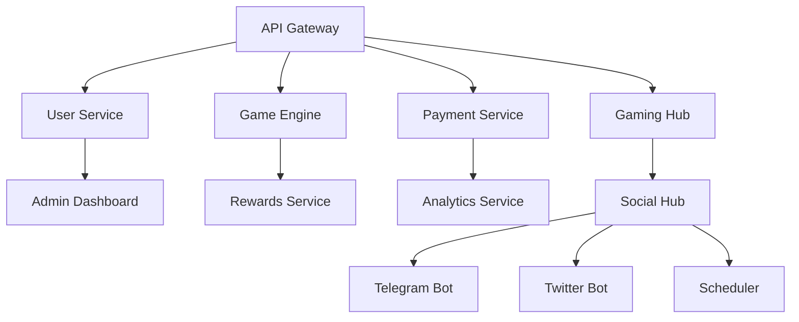

# 🌐 Multi-Platform Deployment Strategy

## 🚨 **Railway Free Plan Limitation**
Railway free plan only allows **5 services maximum**. Here's how to deploy all 12 services across multiple platforms:

## 🎯 **Platform Distribution Strategy**

### **Railway (5 Services)** - Core Critical Services
```bash
✅ api-gateway (Central routing)
✅ user-service (Authentication) 
✅ game-engine (Game logic)
✅ payment-service (Revenue critical)
✅ gaming-hub (Main frontend)
```

### **Vercel (4 Services)** - Frontend & API Services  
```bash
🔄 admin-dashboard (Admin interface)
🔄 rewards-service (Leaderboards)
🔄 analytics-service (Data processing)
🔄 social-hub (Social coordination)
```

### **Render/Fly.io (3 Services)** - Background Services
```bash
🔄 telegram-bot (Social automation)
🔄 twitter-bot (Social automation) 
🔄 scheduler (Background tasks)
```

## 🚀 **Deploy to Railway First (Critical Services)**

Run the priority deployment:
```bash
chmod +x deploy-priority-services-railway.sh
./deploy-priority-services-railway.sh
```

This will deploy the 5 most critical services to Railway:
1. **API Gateway** - Central routing hub
2. **User Service** - Authentication & user management
3. **Game Engine** - VRF, game logic, anti-cheat
4. **Payment Service** - Blockchain payments & revenue
5. **Gaming Hub** - Main user interface

## 🔧 **Environment Configuration**

After Railway deployment, you'll need to update service URLs:

```bash
# Railway deployed services (get actual URLs from Railway dashboard)
API_GATEWAY_URL=https://api-gateway-production.up.railway.app
USER_SERVICE_URL=https://user-service-production.up.railway.app
GAME_ENGINE_URL=https://game-engine-production.up.railway.app
PAYMENT_SERVICE_URL=https://payment-service-production.up.railway.app
GAMING_HUB_URL=https://gaming-hub-production.up.railway.app
```

## 📊 **Service Dependencies**



## 💰 **Cost Comparison**

| Platform | Free Tier | Pro Plan | Best For |
|----------|-----------|----------|----------|
| Railway | 5 services, $5 credit | $20/month | Core backend services |
| Vercel | Unlimited deployments | $20/month | Frontend & API routes |
| Render | 750 hours/month | $7/month per service | Background services |
| Fly.io | 3 apps free | $2.67/month per app | Microservices |

## 🎯 **Recommended Approach**

**For Development**: Use Railway free plan for core 5 services
**For Production**: Upgrade to Railway Pro ($20/month) for all 12 services

## 🚀 **Next Steps**

1. **Deploy priority services to Railway:**
   ```bash
   ./deploy-priority-services-railway.sh
   ```

2. **Get Railway service URLs from dashboard**

3. **Update environment variables with actual URLs**

4. **Test core functionality**

5. **Consider upgrading to Railway Pro for full deployment**

---

**💡 The 5-service Railway deployment will give you a fully functional GameFi platform with all core features!** 