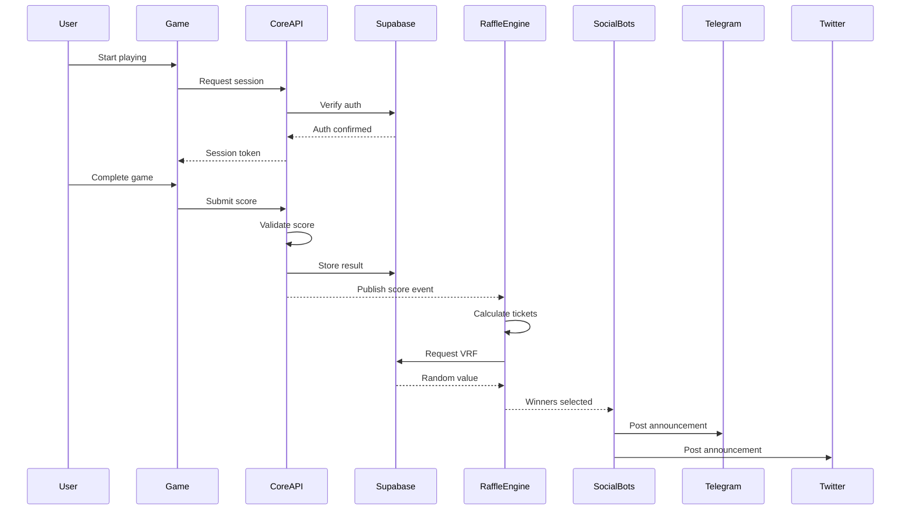

# New Modular Architecture Plan - Complete Separation

## Overview

This architecture plan completely separates the GameFi platform into independent repositories, with each component deployable and maintainable separately.

## Repository Structure

### 1. **gamefi-core-api** (Main Repository)
The core API that handles only the essential P2E mechanics.

**Responsibilities:**
- Lives management (purchase, claiming, tracking)
- Game session verification
- Score validation
- Basic user management
- Payment processing for lives
- API authentication & rate limiting

**Tech Stack:**
- Next.js API Routes / Express.js
- Supabase for database & auth
- TypeScript

**Endpoints:**
```typescript
// Lives Management
POST /api/lives/purchase
POST /api/lives/claim-daily
GET  /api/lives/balance

// Game Sessions
POST /api/game/verify-session
POST /api/game/submit-score
GET  /api/game/validate/{sessionId}

// User Management (via Supabase Auth)
POST /api/auth/login
POST /api/auth/register
GET  /api/user/profile
```

### 2. **gamefi-raffle-engine** (Separate Repository)
Completely independent raffle/lottery system.

**Responsibilities:**
- Raffle creation and management
- Ticket distribution logic
- Winner selection algorithms
- Merkle tree generation
- Prize distribution
- Historical raffle data

**Tech Stack:**
- Node.js / Deno
- Supabase Edge Functions for VRF
- PostgreSQL for raffle data
- Redis for caching

**API Interface:**
```typescript
// Raffle Operations
POST /api/raffle/create
POST /api/raffle/distribute-tickets
POST /api/raffle/draw-winners
GET  /api/raffle/results/{raffleId}
GET  /api/raffle/user-tickets/{walletAddress}

// VRF Operations (via Supabase Edge Function)
POST /api/vrf/request-randomness
GET  /api/vrf/verify/{requestId}
```

### 3. **gamefi-social-bots** (Separate Repository)
All social media integrations and bots.

**Sub-modules:**
- `telegram-bot/` - Telegram bot service
- `twitter-bot/` - Twitter/X bot service
- `discord-bot/` - Discord bot service
- `social-coordinator/` - Cross-platform coordination

**Responsibilities:**
- Winner announcements
- Leaderboard updates
- Community engagement
- Scheduled posts
- Social analytics

**Tech Stack:**
- Node.js
- Bot-specific SDKs
- Message queuing (Bull/RabbitMQ)
- Cron scheduling

### 4. **gamefi-tetris** (Game-Specific Repository)
Tetris game implementation.

**Structure:**
```
gamefi-tetris/
├── frontend/          # React/Next.js game UI
├── game-engine/       # Core Tetris logic
├── integration/       # GameFi SDK integration
├── assets/           # Game assets
└── deployment/       # Game-specific deployment
```

**Integration with Core API:**
```javascript
import { GameFiSDK } from '@gamefi/sdk';

const gamefi = new GameFiSDK({
  apiUrl: process.env.GAMEFI_CORE_API,
  gameId: 'tetris',
  version: '1.0.0'
});

// Game lifecycle
await gamefi.startSession();
await gamefi.validateMove(moveData);
await gamefi.submitScore(finalScore, validationData);
```

### 5. **gamefi-asteroid-blaster** (Game-Specific Repository)
Asteroid Blaster game implementation.

**Structure:** Similar to Tetris, completely independent repository.

### 6. **gamefi-sdk** (Separate Repository)
JavaScript/TypeScript SDK for game integration.

**Features:**
- Easy integration for any HTML5 game
- Wallet connection handling
- Session management
- Score submission
- Anti-cheat helpers
- UI components (leaderboard, lives display)

**Installation:**
```bash
npm install @gamefi/sdk
```

### 7. **gamefi-admin-dashboard** (Separate Repository)
Administrative interface for platform management.

**Features:**
- Analytics dashboards
- User management
- Game configuration
- Revenue tracking
- System monitoring

**Tech Stack:**
- Next.js / React Admin
- Recharts for analytics
- Supabase for data

## Supabase Architecture

### Database Schema
```sql
-- Core API Tables
CREATE TABLE users (
  id UUID PRIMARY KEY DEFAULT gen_random_uuid(),
  wallet_address TEXT UNIQUE NOT NULL,
  auth_id UUID REFERENCES auth.users(id),
  total_lives INTEGER DEFAULT 0,
  lives_purchased INTEGER DEFAULT 0,
  created_at TIMESTAMP DEFAULT NOW()
);

CREATE TABLE game_sessions (
  id UUID PRIMARY KEY DEFAULT gen_random_uuid(),
  user_id UUID REFERENCES users(id),
  game_id TEXT NOT NULL,
  started_at TIMESTAMP DEFAULT NOW(),
  ended_at TIMESTAMP,
  score INTEGER,
  validation_hash TEXT,
  status TEXT DEFAULT 'active'
);

CREATE TABLE lives_transactions (
  id UUID PRIMARY KEY DEFAULT gen_random_uuid(),
  user_id UUID REFERENCES users(id),
  transaction_type TEXT, -- 'purchase', 'daily_claim', 'bonus'
  amount INTEGER,
  cost_mwor DECIMAL,
  transaction_hash TEXT,
  created_at TIMESTAMP DEFAULT NOW()
);
```

### Edge Functions

**VRF Handler** (`supabase/functions/vrf-handler`)
```typescript
import { serve } from "https://deno.land/std@0.168.0/http/server.ts"
import { createClient } from 'https://esm.sh/@supabase/supabase-js@2'

serve(async (req) => {
  const { seed, gameId, sessionId } = await req.json()
  
  // Call Switchboard VRF
  const vrfResult = await requestVRF(seed)
  
  // Store result
  const supabase = createClient(
    Deno.env.get('SUPABASE_URL'),
    Deno.env.get('SUPABASE_SERVICE_ROLE_KEY')
  )
  
  await supabase
    .from('vrf_results')
    .insert({
      game_id: gameId,
      session_id: sessionId,
      vrf_value: vrfResult.value,
      vrf_proof: vrfResult.proof
    })
    
  return new Response(JSON.stringify({ success: true, vrfResult }))
})
```

**Auth Handler** (`supabase/functions/auth-handler`)
```typescript
// Wallet-based authentication
serve(async (req) => {
  const { walletAddress, signature, message } = await req.json()
  
  // Verify wallet signature
  const isValid = await verifyWalletSignature(walletAddress, signature, message)
  
  if (isValid) {
    // Create or update user
    const { data: user, error } = await supabase.auth.admin.createUser({
      email: `${walletAddress}@wallet.local`,
      user_metadata: { wallet_address: walletAddress }
    })
    
    // Generate session
    const session = await supabase.auth.admin.generateLink({
      type: 'magiclink',
      email: user.email
    })
    
    return new Response(JSON.stringify({ session }))
  }
})
```

## Inter-Repository Communication

### 1. **Event-Driven Architecture**
```typescript
// Core API publishes events
await publishEvent('game.score.submitted', {
  userId: user.id,
  gameId: 'tetris',
  score: 150000,
  timestamp: new Date()
})

// Raffle Engine subscribes
subscribeToEvent('game.score.submitted', async (event) => {
  // Calculate tickets based on score
  await distributeTickets(event.userId, calculateTickets(event.score))
})

// Social Bots subscribe
subscribeToEvent('raffle.winners.selected', async (event) => {
  await postToTelegram(formatWinnerAnnouncement(event.winners))
  await postToTwitter(formatWinnerTweet(event.winners))
})
```

### 2. **API Contracts**
Each repository exposes a well-defined API contract:

```typescript
// gamefi-types package (shared types)
export interface GameSession {
  id: string
  userId: string
  gameId: string
  score: number
  validationData: any
}

export interface RaffleTicket {
  userId: string
  raffleId: string
  ticketCount: number
  source: 'game' | 'purchase' | 'bonus'
}
```

## Deployment Strategy

### 1. **Independent Deployments**
- **Core API**: Vercel / Railway / AWS Lambda
- **Raffle Engine**: Cloudflare Workers / Deno Deploy
- **Social Bots**: Heroku / DigitalOcean Apps
- **Games**: Vercel / Netlify / CDN
- **Admin Dashboard**: Vercel / Netlify

### 2. **Environment Configuration**
```env
# Core API
SUPABASE_URL=https://xxx.supabase.co
SUPABASE_ANON_KEY=xxx
SUPABASE_SERVICE_KEY=xxx

# Raffle Engine
CORE_API_URL=https://api.gamefi.com
RAFFLE_DATABASE_URL=postgresql://...

# Games
GAMEFI_API_URL=https://api.gamefi.com
GAMEFI_SDK_KEY=xxx
```

### 3. **CI/CD Pipelines**
Each repository has its own:
- GitHub Actions workflows
- Automated testing
- Deployment triggers
- Version tagging

## Benefits of This Architecture

### 1. **Complete Independence**
- Each component can be developed by different teams
- No deployment coupling
- Technology flexibility per component

### 2. **Scalability**
- Scale only what needs scaling
- Different hosting solutions per component
- Cost optimization

### 3. **Maintainability**
- Clear boundaries
- Focused repositories
- Easier onboarding

### 4. **Security**
- Isolated security contexts
- Minimal attack surface
- Component-specific security measures

## Migration Plan

### Phase 1: Core Extraction (Week 1)
1. Set up `gamefi-core-api` repository
2. Move lives management logic
3. Implement Supabase auth
4. Deploy core API

### Phase 2: Raffle Separation (Week 2)
1. Create `gamefi-raffle-engine` repository
2. Extract raffle logic
3. Set up VRF edge functions
4. Implement event system

### Phase 3: Social Bots (Week 3)
1. Create `gamefi-social-bots` repository
2. Extract Telegram bot
3. Add Twitter bot
4. Set up message queue

### Phase 4: Game Separation (Week 4)
1. Create game-specific repositories
2. Implement SDK integration
3. Deploy games independently
4. Update API connections

### Phase 5: Admin & SDK (Week 5)
1. Create admin dashboard repository
2. Create SDK repository
3. Publish SDK to npm
4. Deploy admin interface

## Example Integration Flow



This architecture provides complete separation while maintaining smooth integration between components!