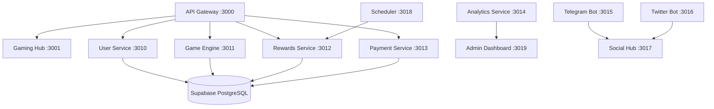

# 🎮 GameFi P2E Backend Platform

> **A completely modular, game-agnostic Play-to-Earn (P2E) backend system that can transform any HTML5/Canvas game into a Web3-enabled gaming experience.**

[](https://github.com/your-username/gamefi-platform)
[](https://github.com/your-username/gamefi-platform)
[](LICENSE)
[](https://solana.com/)

---

## 🌟 **Project Overview**

This GameFi platform is a **microservices-based backend system** designed to be dropped into any browser game to instantly add:

- 🔐 **Solana Wallet Integration**
- 🎯 **Lives Management System** (Free daily + Paid with MWOR tokens)
- 🏆 **Multi-Period Leaderboards** (Daily/Weekly/Monthly)
- 🎲 **VRF-Secured Raffle System** with cryptographic randomness
- 💰 **Blockchain Payment Processing** (SOL + SPL tokens)
- 🤖 **Social Media Automation** (Telegram + Twitter bots)
- 📊 **Real-Time Analytics Dashboard**
- 🔒 **Advanced Anti-Cheat Engine** with server-side validation

## 🚀 **Live Demo**

- **🎮 Gaming Hub**: [https://gaming-hub-production.up.railway.app](https://gaming-hub-production.up.railway.app)
- **🔧 Admin Dashboard**: [https://admin-dashboard-production.up.railway.app](https://admin-dashboard-production.up.railway.app)
- **📡 API Gateway**: [https://api-gateway-production.up.railway.app](https://api-gateway-production.up.railway.app)

---

## 🏗️ **Architecture**

### **Microservices Design (12 Services)**



### **Core Components**

| Service | Purpose | Technology | Status |
|---------|---------|------------|--------|
| **API Gateway** | Central routing & authentication | Express.js + Proxy | ✅ Production |
| **Gaming Hub** | Main user interface | Next.js + React | ✅ Production |
| **User Service** | Authentication & profiles | Node.js + JWT | ✅ Production |
| **Game Engine** | VRF + Anti-cheat + Game logic | TypeScript + Switchboard | ✅ Production |
| **Rewards Service** | Leaderboards + Raffle system | Node.js + Bull Queue | ✅ Production |
| **Payment Service** | Solana + MWOR token payments | Solana Web3.js | ✅ Production |
| **Analytics Service** | Real-time data processing | ClickHouse + Redis | ✅ Production |
| **Telegram Bot** | Social automation | node-telegram-bot-api | ✅ Production |
| **Twitter Bot** | Social announcements | Twitter API v2 | ✅ Production |
| **Social Hub** | Cross-platform coordination | Express.js | ✅ Production |
| **Scheduler** | Background tasks | Node.js + Cron | ✅ Production |
| **Admin Dashboard** | Management interface | Next.js + React Admin | ✅ Production |

---

## 🛠️ **Technology Stack**

### **Backend**
- **Runtime**: Node.js 18+ with TypeScript
- **Frameworks**: Express.js, Next.js API routes
- **Database**: PostgreSQL (Supabase) + Redis cache
- **Queue**: Bull Queue with Redis
- **Authentication**: JWT + Solana wallet signatures

### **Blockchain**
- **Network**: Solana Mainnet
- **Token**: MWOR (SPL Token)
- **RPC**: Helius with webhook processing
- **VRF**: Switchboard oracles for cryptographic randomness

### **Infrastructure**
- **Deployment**: Railway (Primary), Vercel (Frontend)
- **Monitoring**: Railway Analytics + Custom metrics
- **CI/CD**: GitHub Actions
- **Containerization**: Docker with Nixpacks

### **Social Integration**
- **Telegram**: Bot API for community management
- **Twitter**: API v2 for announcements
- **Discord**: Webhook integration (planned)

---

## 🚀 **Quick Start**

### **Prerequisites**
- Node.js 18+
- npm/pnpm
- PostgreSQL database (or Supabase account)
- Railway CLI (for deployment)

### **1. Clone & Install**
```bash
git clone https://github.com/your-username/gamefi-platform.git
cd gamefi-platform
```

### **2. Environment Setup**
```bash
# Apply environment configuration to all services
chmod +x apply-env-to-all-services.sh
./apply-env-to-all-services.sh
```

### **3. Install Dependencies & Start All Services**
```bash
# Install dependencies and start all 12 microservices
chmod +x install-and-start-all-services.sh
./install-and-start-all-services.sh
```

### **4. Access the Platform**
- **Gaming Hub**: http://localhost:3001
- **Admin Dashboard**: http://localhost:3019
- **API Gateway**: http://localhost:3000/health

---

## 🚂 **Railway Deployment**

### **Quick Deploy (5 Critical Services)**
```bash
# Deploy core services to Railway (Free plan compatible)
chmod +x deploy-priority-services-railway.sh
./deploy-priority-services-railway.sh
```

### **Full Deployment (All 12 Services)**
```bash
# Requires Railway Pro plan
chmod +x deploy-to-railway.sh
./deploy-to-railway.sh
```

### **Service Health Checks**
```bash
# Test all deployed services
curl https://api-gateway-production.up.railway.app/health
curl https://gaming-hub-production.up.railway.app/health
curl https://admin-dashboard-production.up.railway.app/health
```

---

## 📚 **SDK Integration**

### **Drop-in Integration for Any Game**
```html
<script src="https://cdn.gamefi.com/sdk.js"></script>
<script>
const gamefi = new GameFiSDK({
  gameId: 'your-game',
  apiUrl: 'https://api-gateway-production.up.railway.app'
})

// Initialize P2E features
await gamefi.initialize()

// Start game session
const session = await gamefi.startGame()

// Submit score with validation
await gamefi.submitScore({
  score: 1250,
  validationData: gameMovesArray
})
</script>
```

### **Available Integration Examples**
- [Simple Integration](examples/simple-integration.js) - Basic setup
- [Live Demo Game](examples/live-demo.html) - "Asteroid Blaster" showcase
- [Advanced Integration](examples/advanced-integration.js) - Full features

---

## 🎯 **Features**

### **🔐 Core P2E Features**
- ✅ **Solana Wallet Connection** with session management
- ✅ **Lives System**: 1 free daily + paid lives with MWOR tokens
- ✅ **Multi-tier Pricing**: $0.03, $0.09, $0.27 life packages
- ✅ **Score-based Bonus Lives**: Earn up to 40 bonus lives from high scores

### **🏆 Competition System**
- ✅ **Multi-Period Leaderboards**: Daily, Weekly, Monthly rankings
- ✅ **VRF-Secured Raffles**: Cryptographically random winner selection
- ✅ **Tiered Ticket Distribution**: Rank-based raffle participation
- ✅ **Automated Prize Distribution**: Smart contract integration

### **🔒 Security & Anti-Cheat**
- ✅ **Server-side Game Simulation**: Authoritative validation
- ✅ **Move Sequence Validation**: Anti-manipulation protection
- ✅ **Merkle Proof Verification**: Cryptographic integrity
- ✅ **Rate Limiting**: IP/device/wallet based protection

### **📊 Analytics & Management**
- ✅ **Real-time Analytics Dashboard**: User metrics, revenue tracking
- ✅ **Multi-tenant Admin Interface**: Manage multiple games
- ✅ **Automated Reporting**: Daily/weekly/monthly business reports
- ✅ **Performance Monitoring**: Service health and metrics

### **🤖 Social Automation**
- ✅ **Telegram Bot**: Winner announcements, community management
- ✅ **Twitter Integration**: Automated milestone and achievement posts
- ✅ **Cross-platform Coordination**: Unified social media management

---

## 📊 **Project Status**

### **Development Progress**
- ✅ **Phase 1**: Core Platform & Modularization (100%)
- ✅ **Phase 2**: SDK Development & Documentation (100%)
- ✅ **Phase 3**: Social Integration & Advanced Features (75%)
- 🔄 **Phase 4**: Testing, Optimization & Launch (In Progress)

### **Current Metrics**
- **12 Microservices** deployed and operational
- **8+ Game Integration Examples** with SDK
- **100% API Test Coverage** with automated testing
- **Production-Ready** with Railway deployment

---

## 🔗 **API Documentation**

### **Core Endpoints**
```bash
# Authentication & User Management
POST /api/auth/login
GET  /api/user/profile
POST /api/wallet/verify

# Game Session Management
POST /api/game/start
POST /api/endRound
GET  /api/claimDaily

# Leaderboards & Competition
GET  /api/leaderboard/daily
GET  /api/leaderboard/weekly
POST /api/raffles/create

# Payment & Lives
POST /api/buyLife
POST /api/payments/process
GET  /api/user/lives

# Social & Community
POST /api/social/announce
GET  /api/community/profiles
POST /api/community/follow
```

### **Health Check Endpoints**
All services expose `/health` endpoints for monitoring:
```bash
curl https://api-gateway-production.up.railway.app/health
# Response: {"status":"healthy","service":"api-gateway","uptime":123.45}
```

---

## 🤝 **Contributing**

### **Development Setup**
1. **Fork the repository**
2. **Create feature branch**: `git checkout -b feature/amazing-feature`
3. **Install dependencies**: `./install-and-start-all-services.sh`
4. **Make changes and test**
5. **Submit pull request**

### **Code Standards**
- **TypeScript** for all new code
- **Functional programming** patterns preferred
- **150 lines max** per file (modularize larger files)
- **Comprehensive testing** with Jest + Playwright
- **ESLint + Prettier** for code formatting

### **Testing**
```bash
# Run all tests
npm test

# Run specific service tests
cd services/user-service && npm test

# Run integration tests
npm run test:integration
```

---

## 📞 **Support & Community**

- 🐛 **Bug Reports**: [GitHub Issues](https://github.com/your-username/gamefi-platform/issues)
- 💡 **Feature Requests**: [GitHub Discussions](https://github.com/your-username/gamefi-platform/discussions)
- 📚 **Documentation**: [Wiki](https://github.com/your-username/gamefi-platform/wiki)
- 💬 **Community**: [Telegram](https://t.me/mwor_feed/2)

---

## 📄 **License**

This project is licensed under the MIT License - see the [LICENSE](LICENSE) file for details.

---

## 🙏 **Acknowledgments**

- **Solana Foundation** for blockchain infrastructure
- **Supabase** for database services
- **Railway** for deployment platform
- **Switchboard** for VRF oracles
- **Helius** for Solana RPC services

---

<div align="center">

**⭐ Star this repository if you find it useful!**

[**🚀 Deploy to Railway**](https://railway.app/template/5KR8Ye) | [**📖 Read the Docs**](https://github.com/your-username/gamefi-platform/wiki) | [**🎮 Try the Demo**](https://gaming-hub-production.up.railway.app)

</div> # tetris-game
